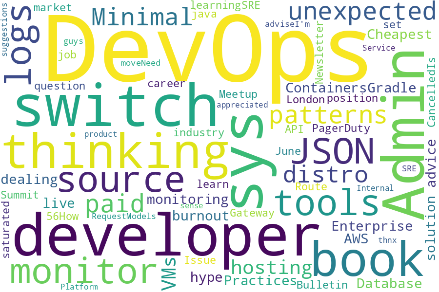

<!--
**jmartinezl/jmartinezl** is a ✨ _special_ ✨ repository because its `README.md` (this file) appears on your GitHub profile.

Here are some ideas to get you started:

- 🔭 I’m currently working on ...
- 🌱 I’m currently learning ...
- 👯 I’m looking to collaborate on ...
- 🤔 I’m looking for help with ...
- 💬 Ask me about ...
- 📫 How to reach me: ...
- 😄 Pronouns: ...
- ⚡ Fun fact: ...
-->

<h2>Hi, I'm Jesús Martinez!  </h2>

<p><em>Python Developer and Cloud Specialist
</em></p>

**👆 You can contact me on [Linkedin](https://www.linkedin.com/in/jes%C3%BAs-martinez-2b7b10104/) or [email me](mailto:jesus.mtz.lorenzo@gmail.com)**

###  A little more about me...  

```json
{
    "code": ["Python", "Javascript", "GoLang","Bash"],
    "databases": ["MySQL", "SQLServer", "PostgreSQL","Aurora"],
    "devOps": [
        "Cloud Platforms": ["AWS", "GCP"],
        "IaC": ["Terraform", "CloudFormation", "AWS SAM"],
        "Containers": ["Docker", "Kubernetes"],
        "Monitoring": ["Cloudwatch", "Datadog"],
        "CI/CD": ["Github Actions", "Jenkins"],
        "Misc": ["Cloudflare", "Route53", "DynamoDB", "Cloudfront"]
    ]
}
```
---



# Top 10 posts of r/DevOps in the last day

| Title | Author | Score |
|:---|:---|:---|
| [Which CD solution would you use - if you had to start fresh?](https://www.reddit.com/r/devops/comments/10o6i2m/which_cd_solution_would_you_use_if_you_had_to/) | gxxgly_eyez | 74 |
| [Microservices Authentication: SAML and JWT](https://www.reddit.com/r/devops/comments/10o8yzd/microservices_authentication_saml_and_jwt/) | bwljohannes | 4 |
| [Looking for platforms with challenges or 'realistic' problems](https://www.reddit.com/r/devops/comments/10ovrkr/looking_for_platforms_with_challenges_or/) | Arraiz0 | 3 |
| [Does it make sense to provide an SLA for a microservices based Saas service?](https://www.reddit.com/r/devops/comments/10owws0/does_it_make_sense_to_provide_an_sla_for_a/) | theBeeprApp | 3 |
| [Whats the best practice on using a package your distro version doesn't support?](https://www.reddit.com/r/devops/comments/10o995h/whats_the_best_practice_on_using_a_package_your/) | BigBootyBear | 2 |
| [Am I missing something? (argo cd and helm in AWS)](https://www.reddit.com/r/devops/comments/10o97jo/am_i_missing_something_argo_cd_and_helm_in_aws/) | from_the_river_flow | 2 |
| [jenkins using variable in withcredentials block?](https://www.reddit.com/r/devops/comments/10ob2el/jenkins_using_variable_in_withcredentials_block/) | Kemkemsem | 1 |
| [When devops (as a practice) start to fall apart](https://www.reddit.com/r/devops/comments/10ozhhx/when_devops_as_a_practice_start_to_fall_apart/) | amarao_san | 1 |
| [Uptime, status pages, and why transparency is often lost](https://www.reddit.com/r/devops/comments/10p06pt/uptime_status_pages_and_why_transparency_is_often/) | shared_ptr | 1 |
| [Lightweight logs collection and discord notifications](https://www.reddit.com/r/devops/comments/10ol2q9/lightweight_logs_collection_and_discord/) | achaayb | 0 |
