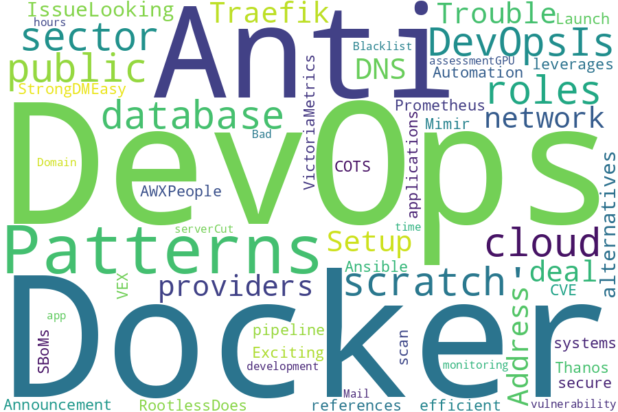

<!--
**jmartinezl/jmartinezl** is a ✨ _special_ ✨ repository because its `README.md` (this file) appears on your GitHub profile.

Here are some ideas to get you started:

- 🔭 I’m currently working on ...
- 🌱 I’m currently learning ...
- 👯 I’m looking to collaborate on ...
- 🤔 I’m looking for help with ...
- 💬 Ask me about ...
- 📫 How to reach me: ...
- 😄 Pronouns: ...
- ⚡ Fun fact: ...
-->

<h2>Hi, I'm Jesús Martinez!  </h2>

<p><em>Python Developer and Cloud Specialist
</em></p>

**👆 You can contact me on [Linkedin](https://www.linkedin.com/in/jes%C3%BAs-martinez-2b7b10104/) or [email me](mailto:jesus.mtz.lorenzo@gmail.com)**

###  A little more about me...  

```json
{
    "code": ["Python", "Javascript", "GoLang","Bash"],
    "databases": ["MySQL", "SQLServer", "PostgreSQL","Aurora"],
    "devOps": [
        "Cloud Platforms": ["AWS", "GCP"],
        "IaC": ["Terraform", "CloudFormation", "AWS SAM"],
        "Containers": ["Docker", "Kubernetes"],
        "Monitoring": ["Cloudwatch", "Datadog"],
        "CI/CD": ["Github Actions", "Jenkins"],
        "Misc": ["Cloudflare", "Route53", "DynamoDB", "Cloudfront"]
    ]
}
```
---



# Top 10 posts of r/DevOps in the last day

| Title | Author | Score |
|:---|:---|:---|
| [How do you keep track of your work notes?](https://www.reddit.com/r/devops/comments/16rtl19/how_do_you_keep_track_of_your_work_notes/) | rcderik | 66 |
| [Release: Netmaker launches open source by switching to Apache -2.0](https://www.reddit.com/r/devops/comments/16rrnkk/release_netmaker_launches_open_source_by/) | pepermuntow | 33 |
| [DevOps open source contributions. Are they worth it?](https://www.reddit.com/r/devops/comments/16rw201/devops_open_source_contributions_are_they_worth_it/) | LandADevOpsJob | 23 |
| [Dead end devops job?](https://www.reddit.com/r/devops/comments/16rypxi/dead_end_devops_job/) | BabyLinuxAdmin | 10 |
| [Nginx vs Cloudflare: Where to deploy "version flags"?](https://www.reddit.com/r/devops/comments/16rqnz9/nginx_vs_cloudflare_where_to_deploy_version_flags/) | FrontendSchmacktend | 7 |
| [Is there any way to find out what in Prometheus is consuming so much memory?](https://www.reddit.com/r/devops/comments/16s7hmq/is_there_any_way_to_find_out_what_in_prometheus/) | chillysurfer | 5 |
| [How to tag docker images in a monorepo?](https://www.reddit.com/r/devops/comments/16ryis2/how_to_tag_docker_images_in_a_monorepo/) | clued__init__ | 4 |
| [How to land an entry-level job/internship with little to no experience?](https://www.reddit.com/r/devops/comments/16siycq/how_to_land_an_entrylevel_jobinternship_with/) | totallytwisteddd | 4 |
| [cloud-concierge: Open source cloud codification, drift detection, and more](https://www.reddit.com/r/devops/comments/16s38pp/cloudconcierge_open_source_cloud_codification/) | jamisonv | 1 |
| [Switching to OSS APM](https://www.reddit.com/r/devops/comments/16sl31d/switching_to_oss_apm/) | Al3xisB | 1 |
